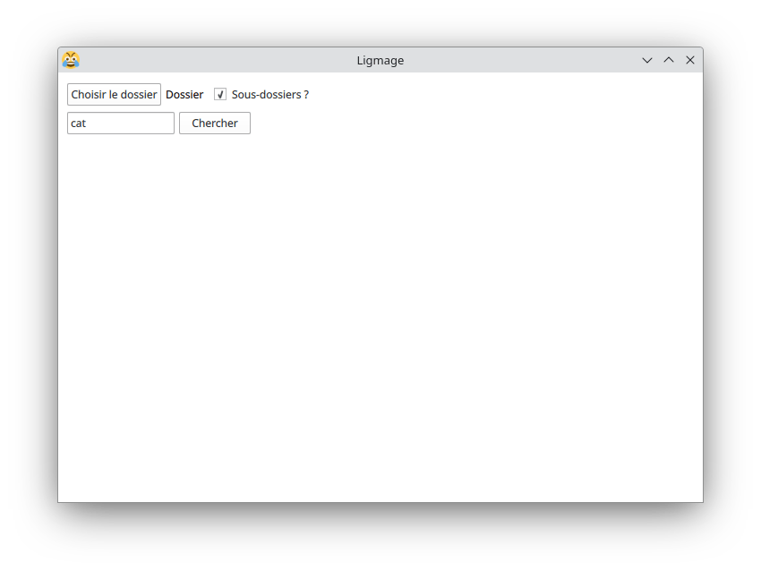
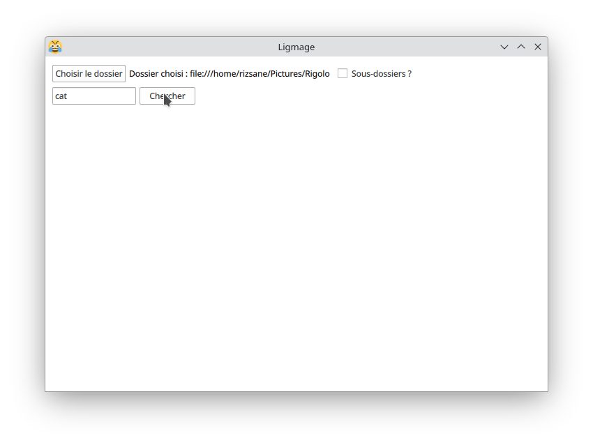
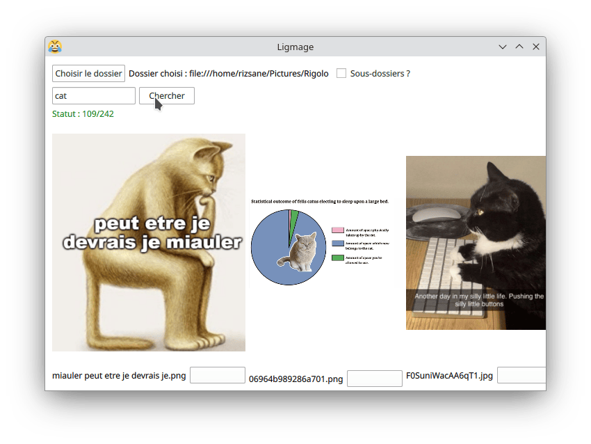

# Parcours utilisateur de LigmageX

1. Ouvrir le projet
2. Run gui.py (le projet télécharge des données du modèle pour une première utilisation)
3. Choisissez un répertoire d'image et un mot-clé pour la recherche
4. Cliquez sur "Chercher"

L'application vous renverra les 3 images du répertoire correspondant le plus au mot-clé choisi. Vous pouvez cliquer sous un bouton sous chaque image pour la copier.

## En images

### Accueil

### Choix du dossier d'images, de la recherche récursive et des termes de recherche

### Affichage des résultats durant la recherche

